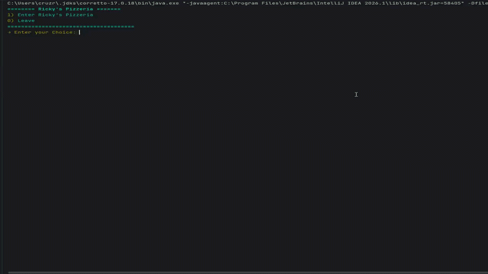
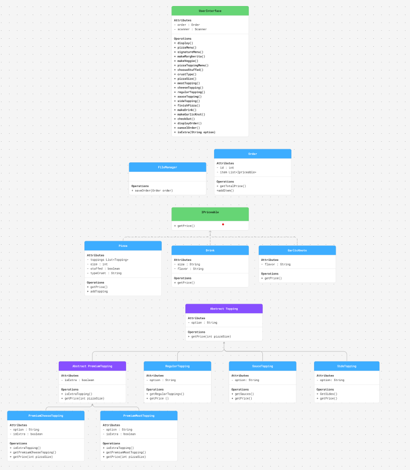

# Rickys-Pizzeria

## Description of the Project

this is a Pizza shop where you can make and build your 
own Pizza, you can also pick any drink and garlic knots you'd like.

## User Stories

As a customer, I want to be able to pick the toppings so that I can get the options i like.

As a customer, I want to be able to view available toppings, sauces, cheeses, and meats so I can choose what I like.

As a customer, I want to be able to choose if i get extra cheese so that I can get the amount i want and control the price

As a customer, I want to be able to see the total price of my order so I know how much I need to pay
## Setup
Instructions on how to set up and run the project using IntelliJ IDEA.

### Prerequisites

- IntelliJ IDEA: Ensure you have IntelliJ IDEA installed, which you can download from [here](https://www.jetbrains.com/idea/download/).
- Java SDK: Make sure Java SDK is installed and configured in IntelliJ.

### Running the Application in IntelliJ

Follow these steps to get your application running within IntelliJ IDEA:

1. Open IntelliJ IDEA.
2. Select "Open" and navigate to the directory where you cloned or downloaded the project.
3. After the project opens, wait for IntelliJ to index the files and set up the project.
4. Find the main class with the `public static void main(String[] args)` method.
5. Right-click on the file and select 'Run 'YourMainClassName.main()'' to start the application.

## Technologies Used

- Java: Mention the version you are using.
- Any additional libraries or frameworks used in the project.

## Demo

## Diagram

## Future Work

Outline potential future enhancements or functionalities you might consider adding:

- Additional feature to be developed.
- Improvement of current functionalities.

## Resources

List resources such as tutorials, articles, or documentation that helped you during the project.

- [Java Programming Tutorial](https://www.example.com)
- [Effective Java](https://www.example.com)

## Team Members

- **Rickelvi Cruz** - Project Lead.

## Thanks

- Thank you to Raymon for continuous support and guidance.
- thank you to Mason and Nurbu for the different perspective
 